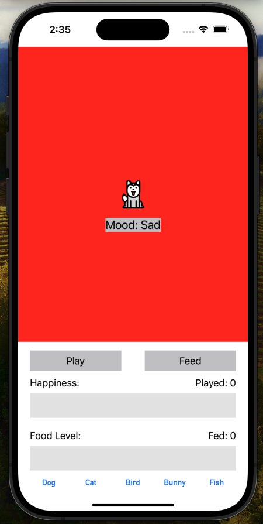
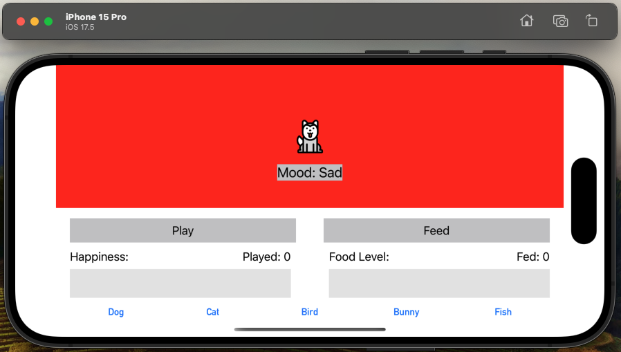

<div align="center">
    <h1 id="Header">Virtual-Pet App</h1>
</div>

## Overview
```
Note: I developed this project as my **Lab 2** assignment for my Mobile App. Dev. class at WashU.
```

The Virtual-Pet App is an interactive mobile application that allows users to select and care for virtual pets. This project was designed to practice mobile app development with Swift and explore concepts such as dynamic UI updates, state management, and animation in iOS applications. The app provides a fun and engaging user experience through visual feedback and rewards.

<div align="center">
    
    
</div>

## Technologies/Frameworks Used
- **Language**: Swift
- **Frameworks**: UIKit, Auto Layout
- **Tools**: Xcode, Interface Builder
- **Design Pattern**: MVC (Model-View-Controller)

## Features
1. **Pet Selection**: Users can choose from five different pets: Cat, Dog, Bird, Bunny, Fish
2. **Interactive Care System**:  
   - **Feeding**: Increase the pet's food level.
   - **Playing**: Increase the pet's happiness level.
   - Animated progress bars update dynamically based on user interactions.
3. **Mood Tracking**: A **Pet Mood Tracker** dynamically updates and displays the pet's mood based on its happiness and food levels.
4. **Mood Animation**: The app provides animated transitions for mood changes, offering real-time visual feedback for user interactions.

## Project Structure
1. **AppDelegate.swift**: Handles app lifecycle events and configurations.
2. **SceneDelegate.swift**: Manages app scenes and UI lifecycle.
3. **ViewController.swift**: Contains the main logic for user interactions and updates to the UI.
4. **DisplayView.swift**: Handles the display elements for pets and updates the interface dynamically.
5. **Pet.swift**: Defines the `Pet` class, including attributes like name, happiness, food level, and methods for interaction.
6. **Info.plist**: Provides configuration details for the app.

